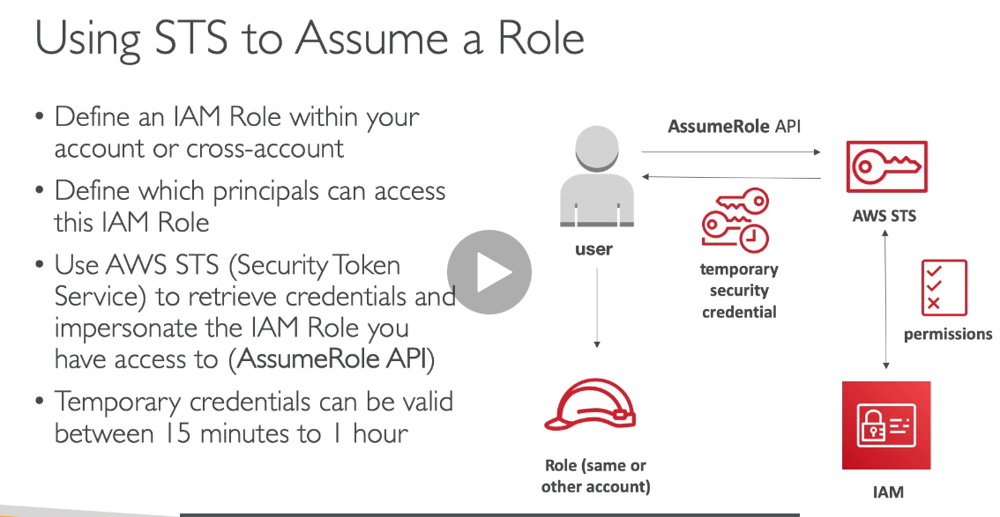
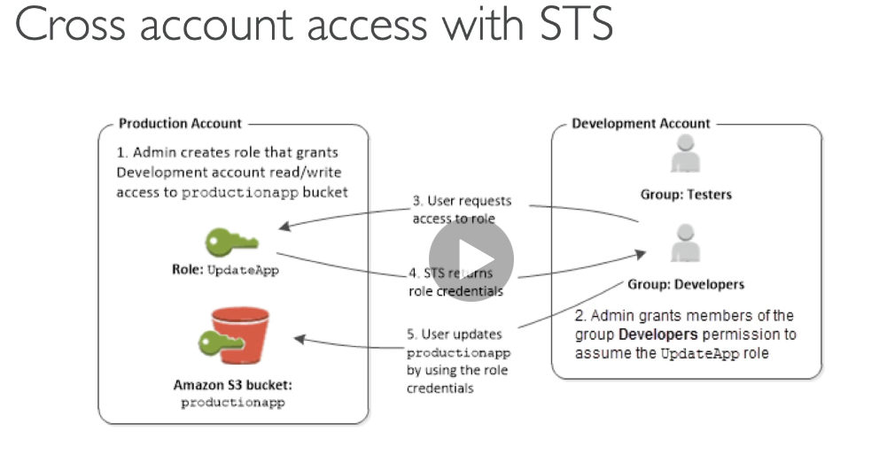

## 213. Security Token Service(STS) Overview

- allows to grant limited/temp access to AWS resources
- valid up to 1 hr. must be refreshed
- apis
  - AssumeRole
    - Cross Account Access
    - within your own acct for enhanced sec
  - AssumeRoleWithSAML
    - returns creds for users logged with SAML
  - AssumeRoleWithWebIdentity
    - returns creds for users logged in with an IDP(fb,google,etc)
    - AWS recommends against using this; Cognito instead
  - GetSessionToken
    - for MFA, from a user or AWS acct root user
- using STS to assume a role
  - define an IAM role within your acct
  - definite which principals can access this IAM role
  - use AWS STS to retrieve creds and impersonate the IAM role you access to(AssumeRole API)
  - temp creds can be valid between 15 mins to 1 hr
    
  - can be done using cross account access
    

#

## 214. Identity Federation & Cognito

- want to have an external source of truth for users
- federation lets users outside of AWS to assume temp roles to accessing AWS resources
- these users assume identity provided access roles
- Federations can have many flavors
  - SAML 2.0
  - custom identity broker
  - web identity federation w/cognito
  - web identity federation w/o cognito
  - single sign on
  - nonsaml with AWS Microsoft AD
- user mgmt is done outside of AWS
- SAML 2.0
  - integrate with AD
  - provide access to AWS cnsle or cli
  - no need to create an IAM user for each emplyee
  - needs to setup a trust between AWS IAM and SAML(both ways)
  - amazon SSO federation is the new managed and simpler way
- custom identity broker application
  - only if identity provider is not cmptable with SAML 2.0
  - the identity broker must determine the appropriate IAM policy
  - uses the STS API
- web identity federation - AssumeRoleWithWebIdentity
  - not recommended by AWS, use Cognito instead
  - three way process
- AWS cognito
  - goal to provide direct access to AWS resources from the client side
  - we dont want to create IAM users for our app
  - log into federated identity provider
  - get temp aws creds back from FIP
  - creds come with a predfined IAM policy starting permissions

#

## 215. Directory Services - Overview

- what is MS AD?
  - found on Win Server with AD domain services
  - database of objects: accts, computer, printers, secgroups
  - centralized mgmt, create accts, assign permissions
  - objects are organized in trees, groups of tress is a forest
- AWS directory services
- 3 flavors
  - AWS managed Microsoft AD
    - create your own AD in AWS
    - establish trust connections with your onprem AD
  - AD Connector
    - directory gateway(proxy) to redirect to onprem AD
    - users are managed on the onprem AD
  - Simple AD
    - AD compatible managed directory on AWS
    - cannot join with onprem AD

#

## 216. Organizations - Overview

- global service
- allows to manage multiple AWS accts
- the main acct is the master acct - you cant change it
- other accts are member accts
- member accts can only be part of one org
- benefits
  - consolidated billing across all accts. single pay method
  - pricing benefits from aggregated usage(volume discounts for EC2,S3...)
  - API is available to automate operations
- strategies
  - create accts per dept, cost center, dev/test/prod, regulations,etc
- organize accts using Organizational Units
- service control policy
  - whitelist or blacklist IAM actions
  - applied at the OU or acct level
  - does not apply to the master acct
  - SCP is applied to all the users and roles of the acct, including root
  - SCP does not affect service linked roles
  - must have an explicit allow
  - restrict access to certain services
- to migrate accounts from one org to another
  - remove member acct from old org
  - send invite to the new org
  - accept invite to the new org from the member account

#

## 217. Organizations - Hands On

-

#

## 218. IAM - Advanced

-

#

## 219. IAM - Policy Evaluation Logic

-

#

## 220. Resource Access Manager (RAM)

-

#

## 221. AWS Single Sign On (SSO) - Overview

-

#

## 222. AWS Single Sign On )SSO - Hands On

-

#

## Quiz 18: Identity and Access Management(IAM) - Advanced - Quiz

-

#
