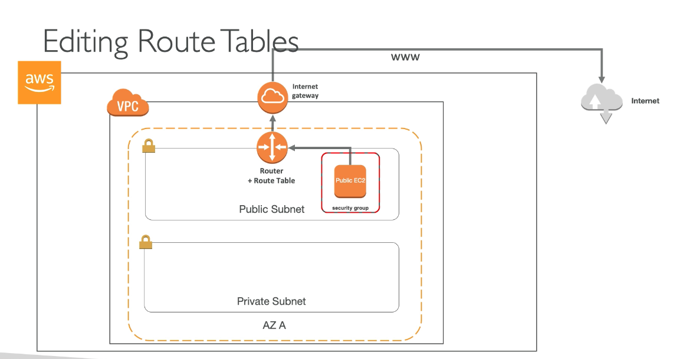
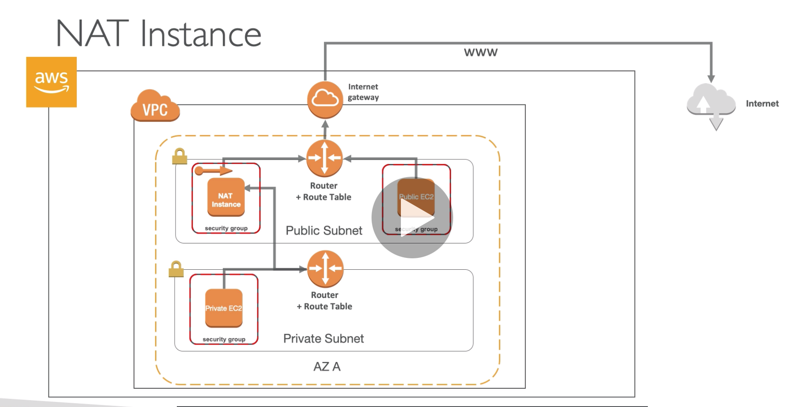
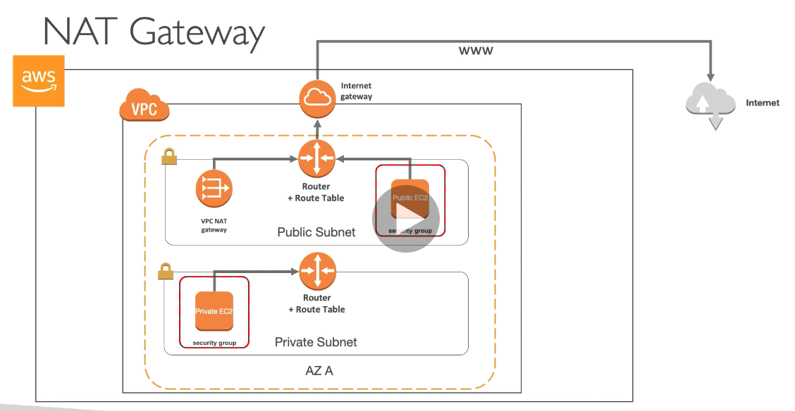

## 237. Section Introduction

- create operate manage a VPC
- 

#

## 238. CIDR, Private vs Public IP

- classless interdomain routing
- help define an IP address range
- 2 components
  - base IP
  - subnet mask /xx part
- base IP part represents an IP contained in that range
- subnet mask defines how many bits can change in the IP
- subnet mask can take 2 forms
  - 255.255.255.0 - less common
  - /24 - more common
- 
- private vs public IP - v4
- allowed ranges
- certain blocks of IP are blocked for private use
- 10.0.0.0/8(10.0.0.0-10.255.255.255) -> big networks
- 172.16.0.0/12(172.16.0.0-172.31.255.255) -> AWS default
- 192.168.0.0/16(192.168.0.0-192.168.255.255)-> common home networks

#

## 239. Default VPC Overview

- all new accts have a default VPC
- new instances are launched into default VPC is not specified
- default VPC has internet connectivity and all instances have public IP
- we also get a public and private DNS name
- VPC in console
- dashboard resources by region
- comes by default with subnets, route table, NACL, internet gateway

#

## 240. VPC Overview and Hands On

- VPC=virtual private cloud
- can have multiple VPCs in a region (max 5 per region - soft limit)
- max CIDR per VPC is 5. each CIDR
  - min size /28 = 16 ip addresses
  - max size /16 = 65536 ip addresses
  - because VPC is private only private ranges are allowed
- your VPC cidr should not overlap with your other networks
- could use wizard, hands on does it manually
- create VPC
- name tag
- CIDR block
- create
- it created a route table, NACL for us
- can add CIDRs, max of 5

#

## 241. Subnet Overview and Hands On

- tied to AZs
- in each AZ create diff subnets/ 1 private 1 public
- subnets in the dashboard
- create subnets
- AWS reserves 5 IP addresses(first 4 and last 1 IP) in each subnet
- these 5 IPs are not available for use and cannot be assigned to an instance
- ex: if CIDR block is 10.0.0.0/24 reserved IPs are:
  1. 10.0.0.0 Network address
  2. 10.0.0.1 reserved by AWS for VPC router
  3. 10.0.0.2 reserved by AWS for mapping to amazon provided DNS
  4. 10.0.0.3 reserved by AWS for future use
  5. 10.0.0.255 network broadcast address. AWS does not support broadcast in VPC, therefore the address is reserved
- exam tip: remember these addresses cannot be used, so if questions ask about available addresses, keep that in mind

#

## 242. Internet Gateways & Route Tables

- IGs help our VPC instances connect with the internet
- it scales horizontally and is HA and redundant
- must be created separately from VPC
- one VPC can only be attached to one IGW and vice versa
- IGW is also a NAT for the instances that have a public IPv4
- IGWs on their own do not allow internet access
  - route tables must also be edited
- adding IGW
  - IGW from left pane
  - create IGW
- need to change route tables
- edit route table for public subnets
  - add all IPs (0.0.0.0/0) as a destination and IGW as target
- 

#

## 243. NAT Instances

- allow instances in private subnets to connect to internet
- nat instances must be launched in public subnet
- must disable EC2 setting: source/destination check
- must attach Elastic IP to it
- route table must be configured to route traffic from private subnets to NAT instance
- 
- nat instances are outdated; summary of what we did:
  - use amazon linux ami preconfiguration as a nat instance
  - not HA/resilient out of the box. would need to create ASG in multiAZ
  - internet traffic bandwidth depends on EC2 instance performance
  - must manage security groups and rules

#

## 244. NAT Gateways

- better alt to Nat instances
- AWS manages NAT, higher bandwidth, better availability, no admin
- pay by hour for usage and bandwidth
- NAT is created in a specific AZ uses an elastic IP
- cannot be used by an instance in that subnet, only from other subnets
- requires an IGW private subnet -> NAT -> IGW
- 5gbs of bandwidth with autoscaling up to 45gbps
- no secgroups to manage/require
- 
- resilient within a single AZ. for HA must create NATGW in multiple AZs
- 

#

## 245. DNS Resolution Options & Route 53 Private Zones

- 2 settings that are important
  - enableDnsSupport - dns resolution setting
  - default is true
  - helps decide if DNS resolution is supported for VPC
  - if true, queries the AWS DNS server at 169.254.169.253
  - enableDnsHostname - DNS Hostname setting
  - false by default for newly created VPC, true by default for default VPC
  - wont do anything unless enableDnsSupport is true
  - if true, assigns public hostname to EC2 instance if it's public
  - if you use custom DNS domain names in a private zone in R53, you must set both of these attributes to true

#

## 246. NACL & Security Groups

-

#

## 247. VPC Peering

-

#

## 248. VPC Endpoints

-

#

## 249. VPC Flow Logs & Athena

-

#

## 250. Bastion Hosts

-

#

## 251. Site to Site VPN, Virtual Private Gateway & Customer Gateway

-

#

## 252. Direct Connect & Direct Connect Gateway

-

#

## 253. Egress Only Internet Gateway

-

#

## 254. AWS PrivateLink - VPC Endpoint Services

-

#

## 255. AWS ClassicLink

-

#

## 256. VPN CloudHub

-

#

## 257. Transit Gateway

-

#

## 258. VPC Section Summary

-

#

## 259. Section Cleanup

-

#

## Quiz 20: VPC Quiz

-

#

## 260. Network Costs in AWS

-

#
