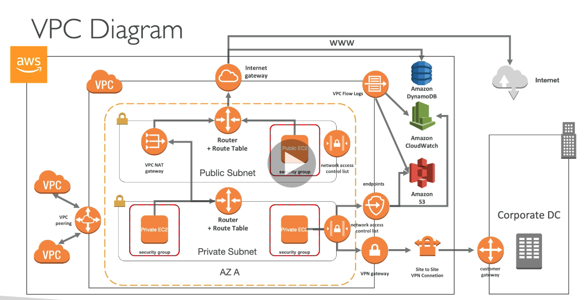

## 237. Section Introduction

- create operate manage a VPC
- 

#

## 238. CIDR, Private vs Public IP

- classless interdomain routing
- help define an IP address range
- 2 components
  - base IP
  - subnet mask /xx part
- base IP part represents an IP contained in that range
- subnet mask defines how many bits can change in the IP
- subnet mask can take 2 forms
  - 255.255.255.0 - less common
  - /24 - more common
- 
- private vs public IP - v4
- allowed ranges
- certain blocks of IP are blocked for private use
- 10.0.0.0/8(10.0.0.0-10.255.255.255) -> big networks
- 172.16.0.0/12(172.16.0.0-172.31.255.255) -> AWS default
- 192.168.0.0/16(192.168.0.0-192.168.255.255)-> common home networks

#

## 239. Default VPC Overview

-

#

## 240. VPC Overview and Hands On

-

#

## 241. Subnet Overview and Hands On

-

#

## 242. Internet Gateways & Route Tables

-

#

## 243. NAT Instances

-

#

## 244. NAT Gateways

-

#

## 245. DNS Resolution Options & Route 53 Private Zones

-

#

## 246. NACL & Security Groups

-

#

## 247. VPC Peering

-

#

## 248. VPC Endpoints

-

#

## 249. VPC Flow Logs & Athena

-

#

## 250. Bastion Hosts

-

#

## 251. Site to Site VPN, Virtual Private Gateway & Customer Gateway

-

#

## 252. Direct Connect & Direct Connect Gateway

-

#

## 253. Egress Only Internet Gateway

-

#

## 254. AWS PrivateLink - VPC Endpoint Services

-

#

## 255. AWS ClassicLink

-

#

## 256. VPN CloudHub

-

#

## 257. Transit Gateway

-

#

## 258. VPC Section Summary

-

#

## 259. Section Cleanup

-

#

## Quiz 20: VPC Quiz

-

#

## 260. Network Costs in AWS

-

#
